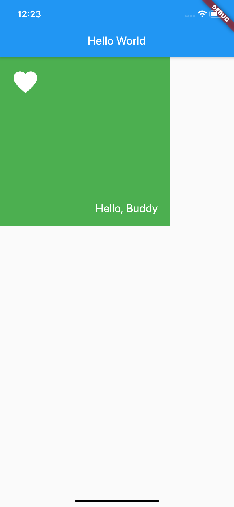

# Stack

[参考](https://juejin.im/post/5d93306cf265da5b7a753a6b#heading-23)

Stack主要用于重叠显示  

```dart
Stack({
  Key key,
  this.alignment = AlignmentDirectional.topStart,
  this.textDirection,
  this.fit = StackFit.loose,
  this.overflow = Overflow.clip,
  List<Widget> children = const <Widget>[],
})  
```

参数j解析：

- alignment：此参数决定如何去对齐没有定位（没有使用Positioned）或部分定位的子widget。所谓部分定位，在这里**特指没有在某一个轴上定位：**left、right为横轴，top、bottom为纵轴，只要包含某个轴上的一个定位属性就算在该轴上有定位。
- textDirection：和Row、Wrap的textDirection功能一样，都用于决定alignment对齐的参考系即：textDirection的值为`TextDirection.ltr`，则alignment的`start`代表左，`end`代表右；textDirection的值为`TextDirection.rtl`，则alignment的`start`代表右，`end`代表左。
- fit：此参数用于决定**没有定位**的子widget如何去适应Stack的大小。`StackFit.loose`表示使用子widget的大小，`StackFit.expand`表示扩伸到Stack的大小。
- overflow：此属性决定如何显示超出Stack显示空间的子widget，值为`Overflow.clip`时，超出部分会被剪裁（隐藏），值为`Overflow.visible` 时则不会。

Stack会经常和Positioned一起来使用，Positioned可以决定组件在Stack中的位置，用于实现类似于Web中的绝对定位效果

```dart
import 'package:flutter/material.dart';
import 'package:flutter/widgets.dart';

main(List<String> args) {
  runApp(MyApp());
}

class MyApp extends StatelessWidget {
  @override
  Widget build(BuildContext context) {
    return MaterialApp(
      home: Scaffold(
        appBar: AppBar(
          title: Text("Hello World"),
        ),
        body: HomeBody(),
      ),
    );
  }
}

class HomeBody extends StatelessWidget {
  @override
  Widget build(BuildContext context) {
    return Stack(
      children: <Widget>[
        Container(
          color: Colors.green,
          width: 300,
          height: 300,
        ),
        Positioned(
          left: 20,
          top: 20,
          child: Icon(
            Icons.favorite,
            size: 50,
            color: Colors.white,
          ),
        ),
        Positioned(
          bottom: 20,
          right: 20,
          child: Text(
            "Hello, Buddy",
            style: TextStyle(
                fontSize: 20,
                color: Colors.white
            ),
          ),
        ),
      ],
    );
  }
}
```



**注意：**Positioned组件只能在Stack中使用。

